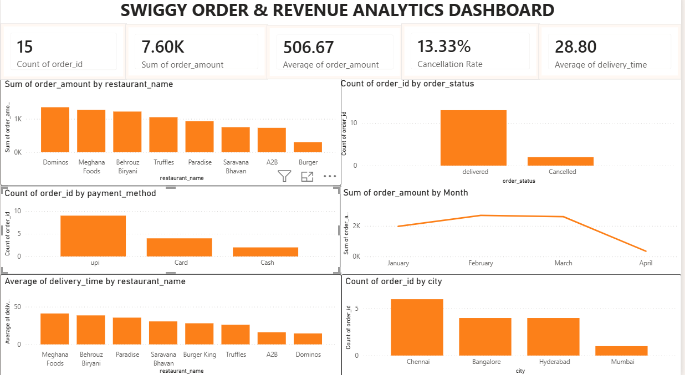

# swiggy_analytics_dashboard
Power BI dashboard analyzing Swiggy food delivery order &amp; revenue data — includes DAX measures, KPI cards, and interactive visualizations.

## Data Analysis Workflow
The project follows a SQL-to-Power BI workflow — data was queried and prepared in SQL (MySQL), then loaded into Power BI for visualization and DAX-based KPI calculations.

## Key SQL Analysis
- Calculated total orders and total revenue
- Calculated average order value
- Analyzed delivered and cancelled orders
- Calculated cancellation rate
- Calculated average delivery time
- Analyzed monthly revenue
- Analyzed orders by payment method
- Analyzed restaurant-wise revenue
- Analyzed city-wise order performance
 
 ## Key Metrics
- Average Order Value: ₹506.67
- Cancellation Rate: 13.33%
- Average Delivery Time: 28.8 mins

## Skills Used
- SQL (MySQL): Data extraction, filtering, joins, aggregations
- DAX measures (DIVIDE, CALCULATE)
- Data visualization & dashboard design
- Power BI theming, layout, and formatting

 ## Dashboard Preview

